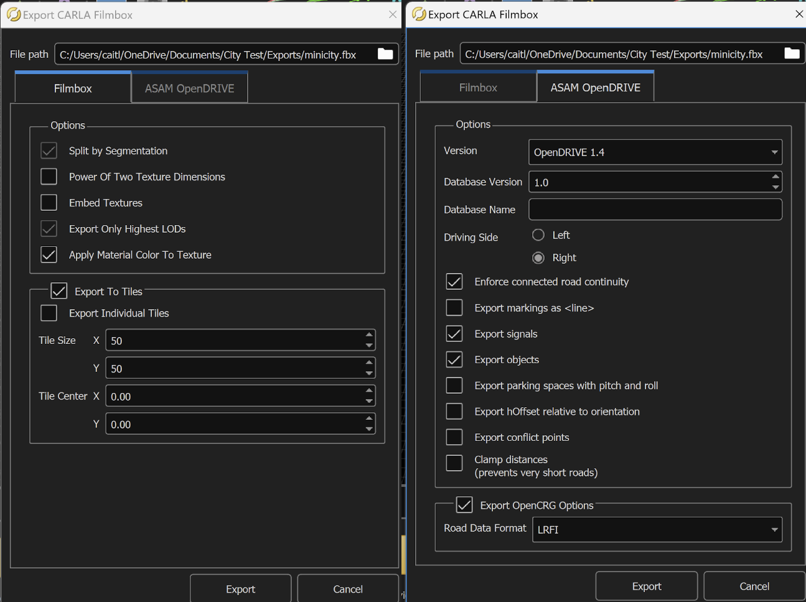

# REU_wrapup

This repository contains files, links, and information about the following:
1. [Additional datasets and LaneNet training for right and left turns at intersections](https://github.com/catac0mb/REU_wrapup/blob/main/README.md#lanenet-training-for-intersections)
2. [Updates to Owen Ma's v-e2e-rl-ad repository](https://github.com/catac0mb/REU_wrapup/blob/main/README.md#updates-to-v-e2e-rl-ad)
3. [3D Modeling with RoadRunner and the CARLA version of Unreal Engine, including Minicity model](https://github.com/catac0mb/REU_wrapup/blob/main/README.md#3d-modeling-with-roadrunner-and-carla-unreal-engine)
   * [Minicity model](https://github.com/catac0mb/REU_wrapup/blob/main/README.md#3d-modeling-with-roadrunner-and-carla-unreal-engine)
   * [Exporting/Importing RoadRunner model]()
   * [3D Modeling in Carla Unreal]()

## LaneNet Training for Intersections
There are now two datasets for LaneNet training for right and left turns at intersections. 
* The right turn dataset contains 359 files, and the left turn dataset contains 330 files.
* Zip files containing both datasets are located [here](https://drive.google.com/drive/folders/10LKjktFrEe_lrjv4_TwvhQ9-Pzauom9r?usp=sharing), along with their corresponding csv files and their trained models.
* The models were trained on images from various CARLA Simulator maps: Town03, Town04, and Town05, as well as the custom MiniCity map (without props or trees). Training was cut off when mIoU and loss reached diminishing returns.

## Updates to v-e2e-rl-ad
The updated fork of Owen's original v-e2e-rl-ad is [here](https://github.com/catac0mb/v-e2e-rl-ad). Notable changes are listed below.
1. Lane detectors:
   * The models mentioned in the above section were added to the log folder in lanenet_lane_detection_pytorch folder, and were incorporated in the CarlaEnv class. 
3. LaneNet training and data creation code:
   * The code in the lanenet_lane_detection_pytorch folder seems to use the TuSimple dataset and json file instead of the methods described in [this](https://docs.google.com/document/d/1EXU5jXaEKWgqxBsn6C817SnIB1FmI7IcWZgUivV2DjU/edit) document.
   * I added a new folder DavidBrodsky_Lanenet with the code from [this](https://github.com/David-Brodsky/LaneNet-Train) repository, which I believe is the code this lab used to train LaneNet, for convenience.
5. Map:
   * The map was changed to Town05 because it has many more intersections.
   * The challenge spawn points for curved lane following in carlaRL_env were altered accordingly, as well as the straight spawn location.
   * A list of spawn points that lead to intersections was also added.
7. High-level planning:
   * A class for generating a high-level plan was added to alt_global_route_planner (as well as the carlaRL_env file to resolve import difficulties). The plan is given a start location and goal location, and generates tuples in the form [location, command].
   * The plan is very limited to encourage autonomous behavior: there is a tuple for the start location, a tuple at every point where the car needs to turn right or left at an intersection, an additional tuple with a new lane following command whenever the car exits an intersection after turning, and a tuple for the goal position.
   * The commands are all either Lanefollow (1), Left (0), or Right (2), and have a corresponding location for where the car needs to start executing each command. Once the car reaches the next location in the plan, the previous tuple is removed and the next command is observed.
9. PPO agent:
    * The agent now takes in the current command as part of the state, which is then put into both the Actor and Critic models.
    * The commands are currently represented by integers 0-2 as outlined above, which are put through simple embedding and linear layers. The command tensor is then concatenated with the image tensor before the fully connected layers.
11. Reward function: the reward function is currently very simple.
    * A negative constant -1 is added if a collision occurs, 0 otherwise.
    * The reward function currently also takes lateral distance from a target waypoint and distance from target steer into account. 
13. Lane changing:
    * I have also added a method for future lane change implementation. There is a method to detect if a lane change is legal, but the CARLA python API can sometimes return an incorrect truth value.
    * I had originally planned to have the model learn to lane change based on if right or left turn is coming next in the plan and if a lane change is legal/possible in that direction. The code in my fork has a simpler model that I ended up experimenting with towards the end.
    * Please refer to the v-e2e-rl-ad_2_command folder in this repository if you would like to see my prelimary lane changing code there.
    * A new LaneNet model might also need to be created to recognize dotted lane markings and solid markings.
   
## 3D Modeling with RoadRunner and CARLA Unreal Engine
Minicity models:
1. RoadRunner model: located in this repository: one folder for the .fbx, .xodr, .geojson, and .xml files, and one folder for the textures. Place all individual files in one folder if importing to CARLA.
2. Unreal Engine model: this model is very large. Please refer to the export guide below to export the RoadRunner files to the carla version of Unreal Engine and make any adjustments: adding traffic lights, props, or trees, changing the buildings to more realistic ones, etc.

A guide for creating custom maps for CARLA simulator is located [here](https://docs.google.com/document/d/1nGkW9r-JUrX9DzVkiATIxvYBm__sEEYetNbHLP2ewoU/edit#heading=h.j5jq9pdnhxqd), including information and instructions about exporting 3D models from RoadRunner and importing to CARLA. The same information is also included below.


## Custom Map Creation and Import/Export Guide
* This guide contains links and documentation updates for 3D modeling with CARLA and RoadRunner.
* Although it is possible to import custom maps using a [packaged installation of CARLA](https://carla.readthedocs.io/en/latest/tuto_M_add_map_package/), you must use Docker to do so and it will require 600-700 GB of space to initially build the image.
* The documentation for importing custom maps using the CARLA source build is [here](https://carla.readthedocs.io/en/latest/tuto_M_add_map_source/), and this guide is intended for the source build version of CARLA.

There is additional documentation [here](https://carla.readthedocs.io/en/0.9.4/how_to_make_a_new_map/) and [here](https://www.mathworks.com/help/roadrunner/ug/export-to-carla.html) for exporting from RoadRunner and importing with the CARLA source build, but some of the instructions are incorrect or unclear. As such, the following guide provides more accurate instructions.


### Start Modeling with RoadRunner
* It is recommended to create the road structure in RoadRunner before importing your map into CARLA. CARLA provides better tools for traffic lights, props, foliage, etc. than RoadRunner, so you might want to model the road structure and road markings in RoadRunner and then add additional things once the model is imported into CARLA. 
* Note that you will need a license to use the RoadRunner application, but [WashU should be able to provide it](https://www.mathworks.com/content/dam/mathworks/mathworks-dot-com/images/responsive/supporting/solutions/automated-driving/roadrunner-tutorial/access-roadrunner-cwl.pdf).


### RoadRunner Tips
* The documentation is [here](https://www.mathworks.com/help/roadrunner/fundamentals.html) for modeling in RoadRunner. [This guide](https://www.mathworks.com/help/roadrunner/ug/choose-a-roadrunner-tool.html) also contains quick information about how to use the modeling tools.
* Please note that RoadRunner crashes quite often. This usually happens if you drag or move something too fast or if you connect roads in an unexpected way. It is recommended to save often. Additionally, if you have added road markings (crosswalks, stencils, etc.) on a road section and then connect another road to it, your markings can disappear. After connecting roads, verify that the road markings are as you intend, or go to a previous save file if needed.


### Exporting a Custom Map in RoadRunner
Once you have completed your model in RoadRunner, you can export your model files. Keep in mind that all exported files should be placed in the same folder during the import step.

1. In RoadRunner, select “File”, then “Export”.
2. Select “CARLA Filmbox”, and a menu will pop up: 
3. Ensure that “Export to Individual Tiles” is not selected. Tile Size may need adjustments, but you will need to check that after importing to Unreal.
4. Select “Export” to export the files into your desired location. This may take several minutes depending on the 3D model’s complexity.

In the folder with the exported files, ensure that the textures/materials used in the 3D model are also in the folder, as well as the .xodr and .fbx files. The .xodr file contains information about how the road network functions, such as road geometries and lane information. The .fbx file contains the actual 3D meshes. Ensure that the .xodr and .fbx files have the same name before importing into CARLA.


### Importing a Custom Map to CARLA Unreal Engine
Once you have exported your files from RoadRunner, place the .xodr, .fbx, and materials files in the “Import” folder located in the carla root folder on your machine. The .geojson and .xml files should not be needed. Ensure that the .xodr and .fbx files have the same name and that no map files in the Unreal content browser already have this name.

1. Run the following commands in the carla root folder to import your model and launch Unreal Engine. The import process may take seveal minutes:
```Shell
     make import ARGS="--no-carla-materials"
     make launch
```

2. Open the “map packages” folder in the content folder at the bottom of the screen of Unreal Engine. Go to Content/map_package/maps and open the folder with the name of your map.
3. Double click on your map file. It should be an icon with gray map geometries on it and an orange bar at the bottom. If you hover over it, it should be labeled yourmapname (level) to indicate that it is a map file.
4. After double clicking, the map should be generated on the map with its textures. This may take several minutes.

Once you have imported your map into CARLA, you can add additional elements to it using the Unreal Engine interface. Make sure to save as you make changes, and keep multiple versions.

## 3D Modeling in Unreal Engine
You may want to make adjustments to the model to make it more realistic and include things like traffic lights, props, or trees. If you want to add more roads or change the road network, it is recommended to do that in RoadRunner and then import it to Unreal.

### Changing Buildings
The RoadRunner buildings are not very realistic. To replace them with Unreal Engine's building meshes and textures, follow the guide below.

### Adding Trees
RoadRunner has an issue with the foliage looking off when importing to Unreal.

### Adding Traffic Lights
The RoadRunner traffic lights might not export the way you want them to.
Adding a single light may cause the server to crash. Please follow the directions [here](https://carla.readthedocs.io/en/latest/tuto_M_custom_add_tl/) and create a junction of multiple lights with BP_TrafficLightGroup.

### Adding Props


